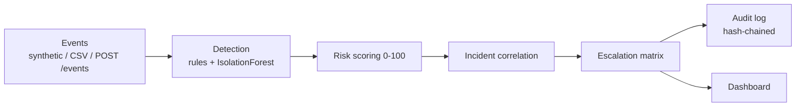
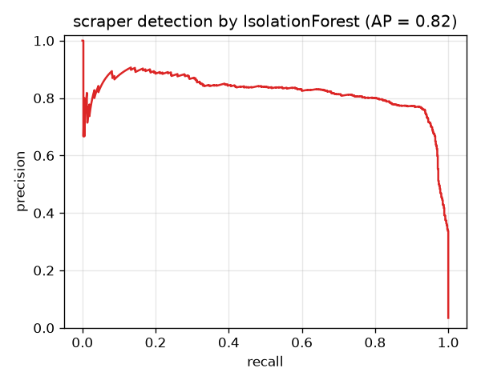
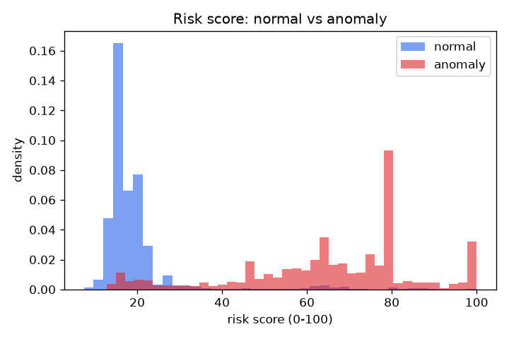

# AlertNotifier

A domain-agnostic **real-time risk monitoring & escalation engine**. One
pipeline — **ingest → detect → score → correlate → escalate → audit →
dashboard** — that watches a stream of entity events, flags the risky ones, and
records every decision. Point it at any source (a synthetic generator now; a
CSV, log stream, or API later) without touching the engine. See
[PLAN.md](PLAN.md) for the full build plan and the generic anomaly taxonomy.

> The default dataset is **synthetic**. What the project demonstrates is the
> engineering: a clean pipeline, detection you can *measure* (real
> precision/recall, since the data is labelled), incident correlation,
> tamper-evident auditing, and a live dashboard.

## Architecture



## Results

Measured on the labelled synthetic data:

| Metric | Value |
|---|---|
| Rules alone — overall recall / precision | 55% / 85% |
| **Rules + IsolationForest — recall / precision** | **90% / 76%** |
| Scraper recovery: rules → ML | **0% → 99.7%** |
| Risk score, median (normal vs anomaly) | 16 vs 48–80 |
| Consolidation (events → alerts → incidents) | 21,224 → 3,079 → 1,017 |
| Audit log | hash-chained; tampering caught at the exact row |

<p>
  
  
</p>

Per-detector detail — what each catches/misses, thresholds, and measured
precision/recall: **[docs/detector_cards.md](docs/detector_cards.md)**.

## Setup

```bash
python -m venv .venv
.venv\Scripts\activate          # Windows
pip install -r requirements.txt
```

## Generate data

```bash
python scripts/generate_events.py
```

Produces `data/generated/api_events.{csv,parquet}` — ~21k API-request events
from 60 clients (~12% labelled anomalies). Each row is an `Event`; the
`gt_is_anomaly` / `gt_anomaly_type` columns are **ground truth for evaluation
only** — detectors must never read them.

**Theme — API / client abuse.** Entities are API clients, each event is one
request. The six generic anomaly types map to: latency/payload spikes, sustained
error-rate drift, request-rate bursts or client silence, off-baseline access
hours, access-tier changes, and a scraper signature (many endpoints + fresh IP +
small payloads — the multivariate case for the ML layer).

## Evaluate the detectors

```bash
python scripts/run_detectors.py
```

Runs the rule detectors and prints precision / recall / false-positive rate per
detector against the labels, plus a PR curve (saved to `docs/eval/`). The rules
catch the clear-cut anomalies but 0% of the scraper case — the gap the ML layer
(Phase 3) closes.

```bash
python scripts/run_ml.py
```

Fits the IsolationForest and measures it against the held-out scraper the rules
miss entirely: it recovers **99.7%**, lifting the combined system's overall
recall from 55% to 90% (F1 0.67 → 0.82).

```bash
python scripts/run_scoring.py
```

Scores every event 0–100 (weights in `config/scoring_config.yaml`). Normal
traffic medians ~16, anomalies ~48–80 — a clean single dial for escalation.

```bash
python scripts/run_incidents.py
```

Correlates the raw alerts into incidents (**21k events → ~1k incidents**) and
routes each through the escalation matrix (`config/escalation_matrix.yaml`) —
log, notify analyst, page security, or auto-contain by severity.

```bash
python scripts/run_replay.py
```

Replays the incidents through a **hash-chained** audit log (SQLite) and proves
it's tamper-evident — editing any past row is detected at that exact row.

```bash
streamlit run dashboard/app.py
```

The live dashboard: KPIs, risk-score distribution, a filterable incident feed
with drill-down, an auto-generated window summary, and the tamper-evident audit
trail.

## Live ingestion API

```bash
uvicorn --app-dir src alertnotifier.ingestion.api:app --reload
```

`POST /events` validates a batch of events against the schema, scores each with
the served IsolationForest + stateless rules, and returns the risk score and
escalation action per event. (The model is fit once on the historical data —
trained offline, served online.)

## Layout

```
src/alertnotifier/   engine — models, pipeline, detectors, scoring, correlation, escalation, audit, ingestion (API + replay), evaluation
scripts/            data generator + evaluation / replay runners
config/             scoring_config.yaml, escalation_matrix.yaml
dashboard/          Streamlit app
tests/              pytest suite (27 tests)
docs/               detector_cards.md + eval charts
```
